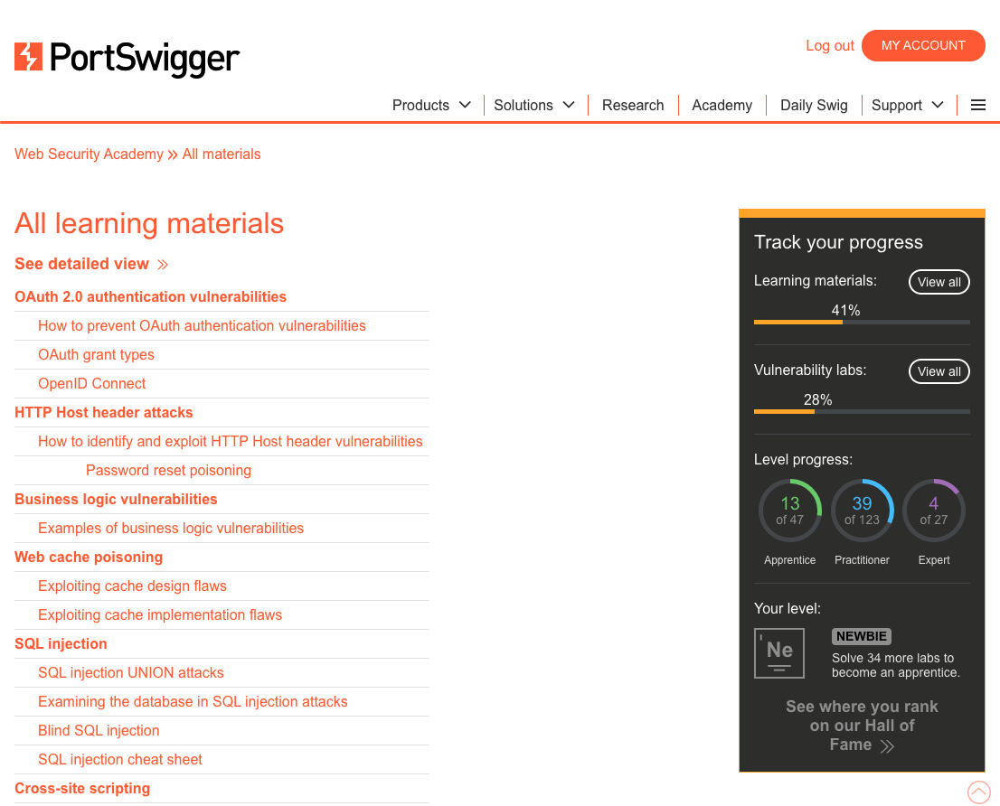

# PortSwigger Web Security Academy Enhanced (Chrome Extension)

## Keep track of what learning materials you have completed in the PortSwigger Web Security Academy, all on one page.

### Note: I am not affiliated with PortSwigger in any way. This is a personal project to enhance the Web Security Academy experience. I was having trouble keeping track of which learning materials I had completed, so I created this extension to easily view progress on one screen.

## Screenshots
### Without this extension:

### With this extension:

## To run:

1. Clone or download this repository
1. Open the extensions page in chrome through the three dots -> More Tools -> Extensions
1. Turn on developer mode (in the upper right corner of the page)
1. Click "Load unpacked"
1. Select the downloaded (unzipped) folder
1. Go to https://portswigger.net/web-security/all-materials (and make sure you are logged in)
1. See a ✅ next to items you have completed, and a ❌ next to items you have not completed
